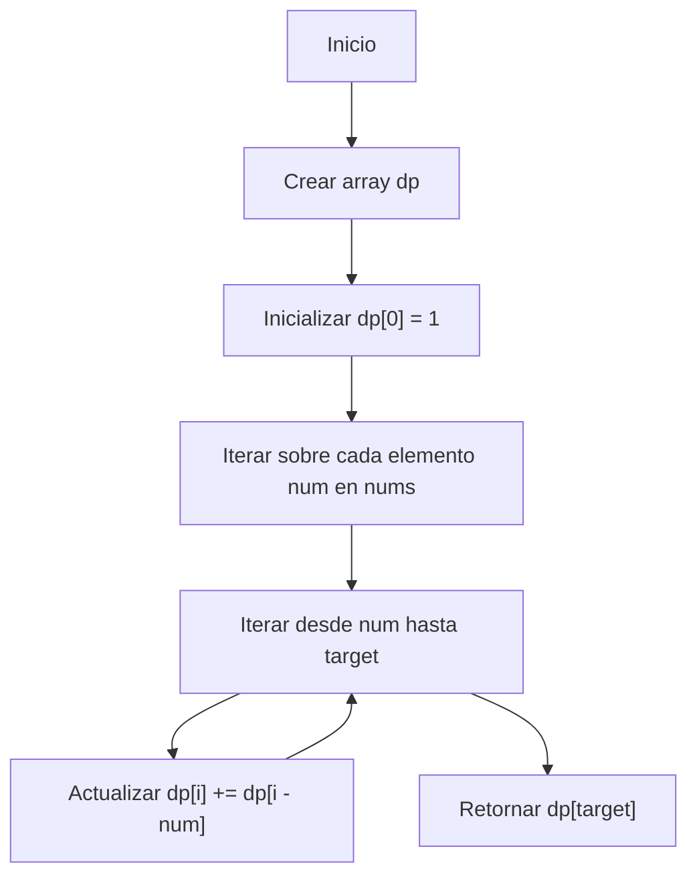

```mermaid
graph TB
A["Inicio"]
B["Crear array dp"]
C["Inicializar dp[0] = 1"]
D["Iterar sobre cada elemento num en nums"]
E["Iterar desde num hasta target"]
F["Actualizar dp[i] += dp[i - num]"]
G["Retornar dp[target]"]
A --> B
B --> C
C --> D
D --> E
E --> F
F --> E
E --> G
```