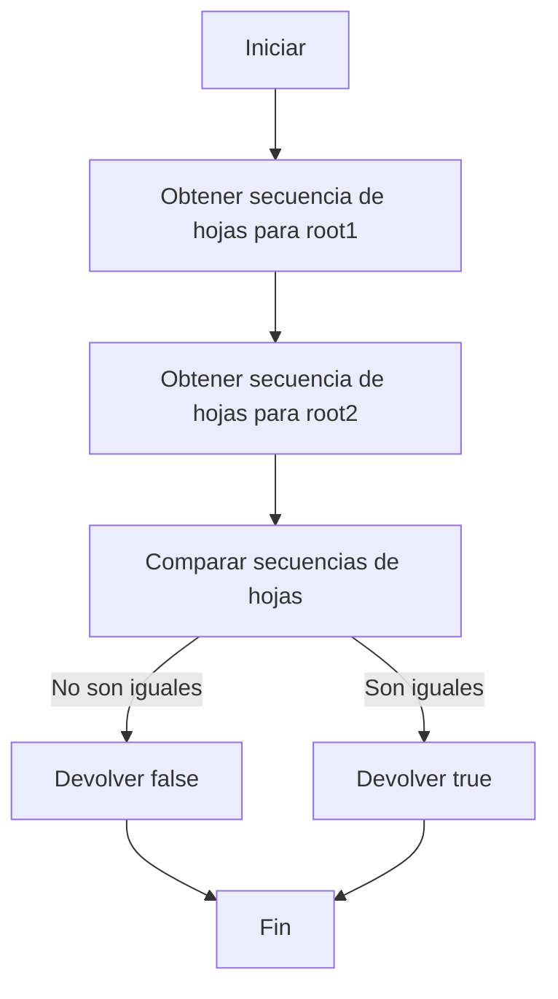

```mermaid
graph TB

A[Iniciar]
B[Obtener secuencia de hojas para root1]
C[Obtener secuencia de hojas para root2]
D[Comparar secuencias de hojas]
E[Devolver true]
F[Devolver false]
G[Fin]

A --> B
B --> C
C --> D
D -->|Son iguales| E
D -->|No son iguales| F
F --> G
E --> G
```